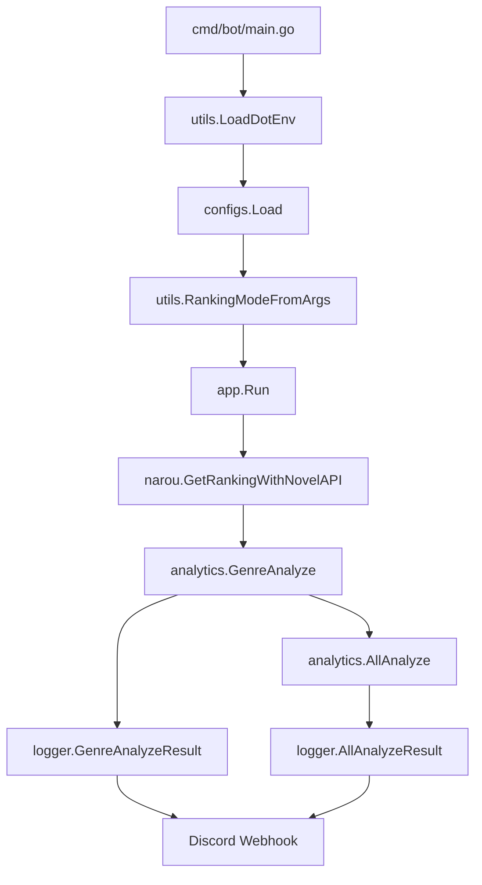

# Codebase Guide

このドキュメントは、コードを読む・変更する人向けの詳細ガイドです。

## Package Overview

```text
cmd/bot
  エントリポイント。dotenv を読み、設定とランキングモードを作って app.Run を呼ぶ。

configs
  環境変数とデフォルト値を Config に集約する。

internal/app
  アプリケーションの orchestration。クライアント生成、ジャンル別並列解析、全体解析、Discord 送信をつなぐ。

internal/client/narou
  なろう API client、レスポンス model、JSON parser。

internal/analytics
  小説一覧から分析指標を作る。AI への prompt 生成と AI レスポンス parser もここにある。

internal/client/gpt
  OpenAI API 互換 client の薄い wrapper。

internal/client/discord
  Discord Webhook の HTTP client と payload model。

internal/logger
  分析結果を Discord Webhook 用の embed に整形して送信する。

internal/utils
  dotenv 読み込みと CLI 引数からランキングモードを解釈する補助。
```

## Main Flow



`app.Run` は `narou.BigGenres` を走査し、各大ジャンルを goroutine で並列解析します。並列数は `Config.GenreAnalyzeConcurrency` で制御します。

## Dependency Direction

基本的な依存方向は次の通りです。

```text
cmd/bot -> configs, internal/app, internal/utils
internal/app -> analytics, clients, logger
analytics -> narou model, gpt interface
logger -> analytics model, discord client
clients -> 外部 API
```

`configs` はアプリ全体の設定型を持ちます。`internal/app` は `type Config = configs.Config` で alias して、既存の呼び出し側が読みやすいようにしています。

## Configuration

設定値は [configuration.md](configuration.md) に一覧があります。

コード上では `configs.Load()` が `Config` を返します。

重要なフィールド:

- `NarouUrl`
- `NarouUserAgent`
- `NarouRankingLimit`
- `GenreAnalyzeConcurrency`
- `OpenAIApiKey`
- `OpenAIBaseURL`
- `OpenAIModel`
- `DiscordWebhookURL`
- `DiscordTimeout`

OpenAI API 互換 API は Deni をデフォルトにしています。

```go
DefaultOpenAIBaseURL = "https://api.deniai.app/v1"
DefaultOpenAIModel = "openai/gpt-5.2"
```

## App Orchestration

`internal/app/run.go` の `Run` が中心です。

主な処理:

1. `OpenAIApiKey` があれば `gpt.OpenAIClient` を作る
2. `narou.NarouClient` を作る
3. `discord.DiscordClient` と `logger.WebhookLogger` を作る
4. `narou.BigGenres` を並列処理する
5. 各ジャンルで `analyzeGenre` を実行する
6. 成功した `GenreAnalyzeResult` を channel で集める
7. `analytics.AllAnalyze` で全体集計する
8. 全体分析結果を Discord に送る

`analyzeGenre` は、1ジャンル分の処理を閉じ込めています。

```text
GetRankingWithNovelAPI -> GenreAnalyze -> GenreAnalyzeResult webhook
```

ログでは `ファンタジー(2)` のように、ジャンル名とコードを両方出します。AI へも `TargetGenreName` としてジャンル名を渡します。

## Narou Client

`internal/client/narou` は、なろう API との通信と JSON decode を担当します。

### `GetRankingWithNovelAPI`

現在のメイン取得処理です。

```text
GET /novelapi/api/?biggenre={code}&lim={limit}&order={order}&out=json
```

`RankingMode` と `novelapi` の `order` は次の対応です。

| Mode | order |
| --- | --- |
| daily | `dailypoint` |
| weekly | `weeklypoint` |
| monthly | `monthlypoint` |
| quarterly | `quarterpoint` |
| yearly | `yearlypoint` |

`GetRanking` は旧 `rank/rankget` 用の処理として残っています。

### Parser

なろう小説 API の JSON は配列形式です。

```json
[
  {"allcount": 1},
  {"title": "...", "ncode": "..."}
]
```

`Response.UnmarshalJSON` が先頭の metadata と作品リストを分離します。

`RankingWithNovelAPIResult.UnmarshalJSON` は `Response` を経由して `[]Novel` に変換します。

## Analytics

詳しい分析ロジックは [analytics.md](analytics.md) にまとめています。

入口:

- `Analyzer.GenreAnalyze`
- `Analyzer.AllAnalyze`

`GenreAnalyze` は `[]narou.Novel` を `GenreAnalyzeResult` に変換します。AI client が設定されている場合は、集計結果を JSON prompt にして AI 要約も追加します。

`AllAnalyze` は複数の `GenreAnalyzeResult` を集約して `AllAnalyzeResult` を作ります。

## AI Client

`internal/client/gpt` は OpenAI SDK を使っています。

`OpenAIConfig.BaseURL` を指定すると、OpenAI API 互換 host に差し替わります。

```go
openAIConfig := openai.DefaultConfig(config.ApiKey)
openAIConfig.BaseURL = config.BaseURL
client := openai.NewClientWithConfig(openAIConfig)
```

AI レスポンスは JSON のみを期待します。コードフェンス付き JSON も `stripJSONFence` で許容します。

## Discord Output

`internal/logger` は分析結果を Discord embed に変換します。

通常テキスト送信:

- `WebhookLogger.Log`

分析結果送信:

- `WebhookLogger.GenreAnalyzeResult`
- `WebhookLogger.AllAnalyzeResult`

embed field は Discord の制限を考慮して `discordEmbedFieldLimit` で truncate します。

## Testing Strategy

主なテスト観点:

- API client が正しい path / query を送る
- なろう API の特殊な配列 JSON を decode できる
- 分析指標が期待通りに計算される
- AI prompt に必要な集計値・ジャンル名が入る
- Discord Webhook payload が embed として構成される
- 長文 AI 分析でも Discord field limit を超えない
- `Run` がジャンル別解析を並列実行する

実行:

```bash
go test ./...
```

## Adding a New Metric

新しい分析指標を追加する場合の基本手順:

1. `internal/analytics/model.go` に result struct を追加する
2. `analyzeNovels` または `AllAnalyze` で値を計算する
3. `GenreAnalyzeResult.String` / `AllAnalyzeResult.String` に必要なら表示を追加する
4. `buildGenreAIPrompt` / `buildAllAIPrompt` に AI 用 payload を追加する
5. `internal/logger/webhook.go` の embed field に追加する
6. analyzer と logger のテストを追加する

## Adding a New Ranking Mode

1. `internal/client/narou/client.go` の `RankingMode` に値を追加する
2. `novelAPIOrder` に `order` 変換を追加する
3. `internal/utils/utils.go` の `RankingModeFromArgs` に CLI alias を追加する
4. GitHub Actions の choice や schedule が必要なら `.github/workflows/analyze.yaml` を更新する
5. tests を追加・更新する
